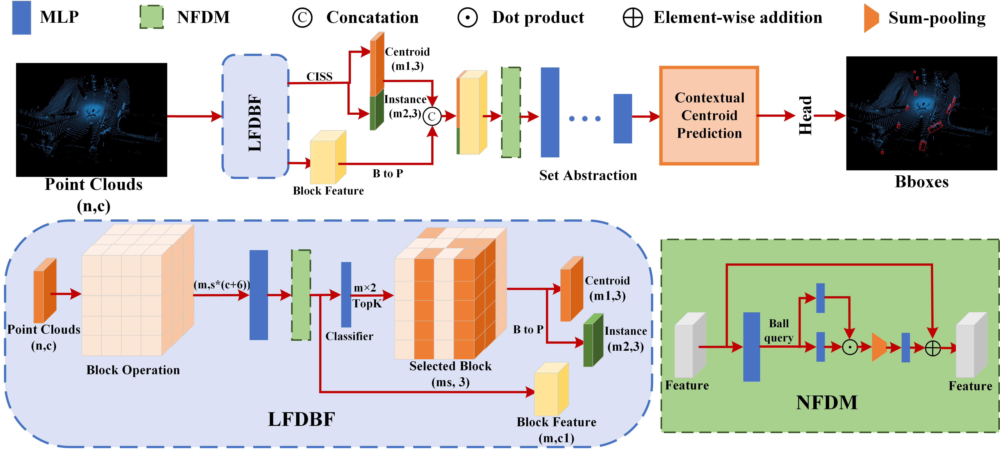
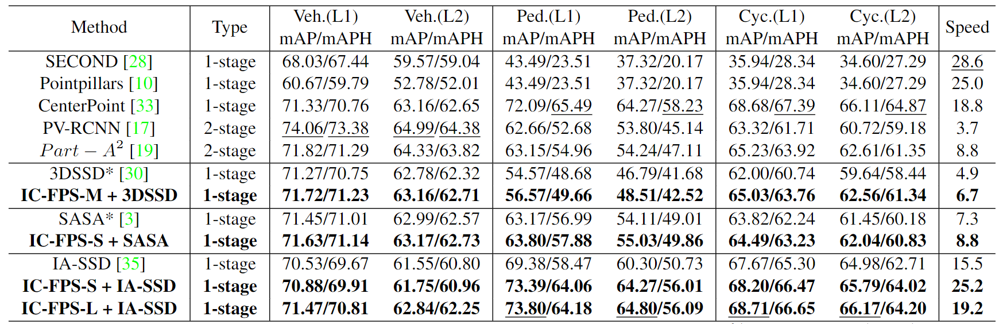
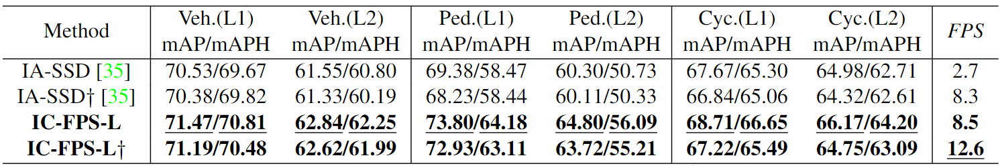
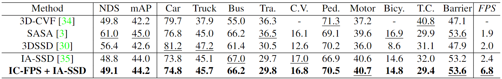
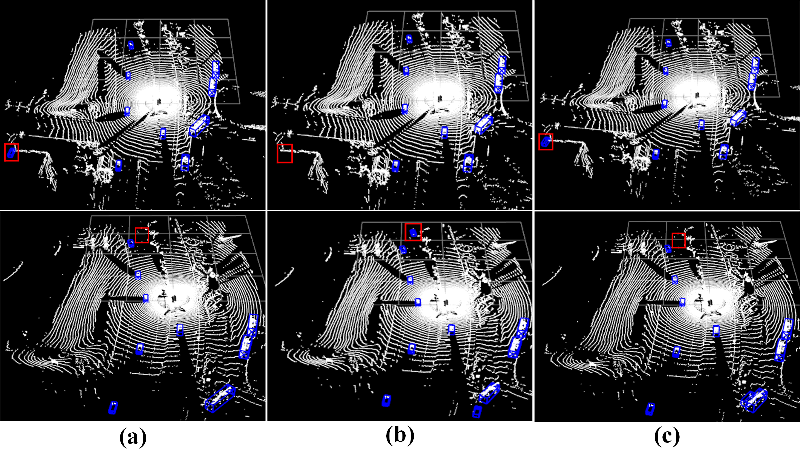
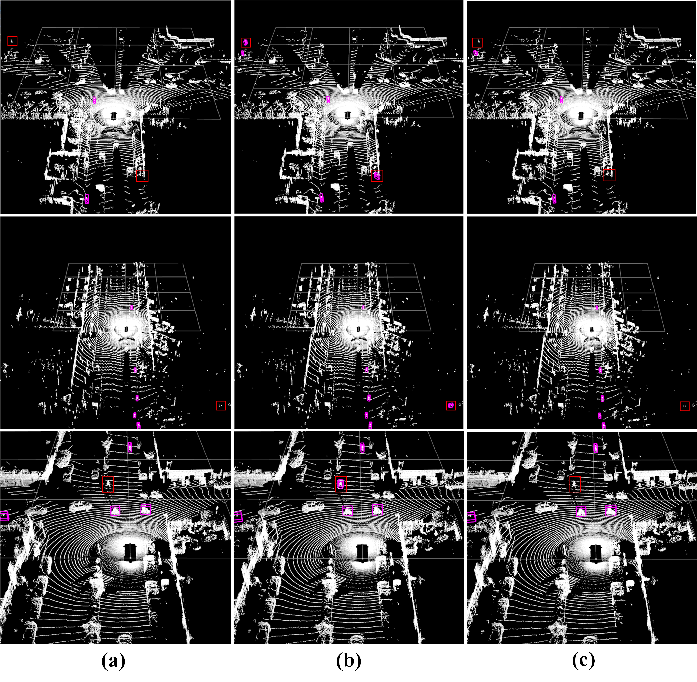
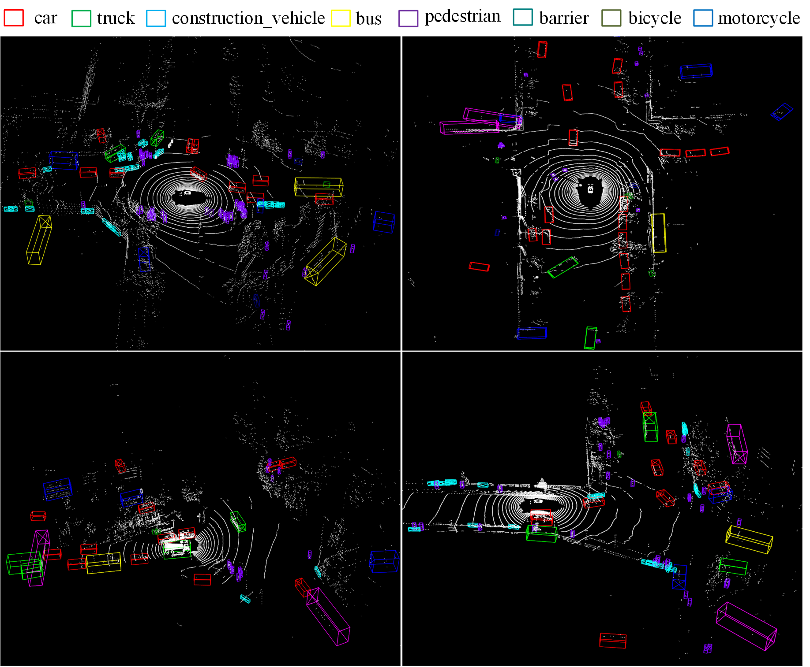

# IC-FPS: Instance-Centroid Faster Point Sampling Module for 3D Point-base Object Detection
 
 [paper](https://arxiv.org/abs/2303.17921)

## News
+ **2023.4.6**  create README.md
 
## Main Result
### Waymo detection validation

Quantitative comparison experiments on the Waymo val set for 3D object detection. 20% of training set ( 32K) is used for
training. 

Quantitative comparsion experiments on Waymo val set for 3D object detection. † indicates that the whole scene is divided into
four parts to accelerate SA layer. Bold texts are our results and the best results are underlined.

### ONCE detection validation

Quantitative comparison experiments on ONCE validation set. Bold texts are our results, underlined texts are the best results.
Performance indexes follow the same configurations given in [IA-SSD](https://github.com/yifanzhang713/IA-SSD)

### nuScenes detection validation



### Visualization results

Visulization results of Waymo dataset Vehicle. (a)ground-truth, (b) IA-SSD, (c) IC-FPS+IA-SSD. Red boxes represent differences of various results.

Complementary visualization of Waymo Dataset Pedestrian, (a) ground truth, (b) IA-SSD, (c) IC-FPS + IA-SSD. Bounding boxes in red are the difference, green are the Pedestrian.

Complementary visualization of Waymo Dataset Cyclist. (a) ground truth, (b) IA-SSD, (c) IC-FPS + IA-SSD. Boundingboxes in red are the difference, purple are the cyclist.

Complementary visualization of our methods on nuScenes Dataset.
## Use IC-FPS
### install and date preparation
For environment installation method, please refer to [IA-SSD](https://github.com/yifanzhang713/IA-SSD).

### beachmark Evaluation and Training

```shell
# training example for IC-FPS
cd tools && scripts/dist_train.sh 8 --cfg_file cfg/waymo_models/PTC.yaml --extra_tag IC-FPS

#evaluation example for IC-FPS
cd tools && scripts/dist_test.sh 8 --cfg_file cfg/waymo_models/PTC.yaml --ckpt YOUR_WEIGHT --extra_tag IC-FPS
```

## Acknowlegement
We sincerely thank the authors of [IA-SSD](https://github.com/yifanzhang713/IA-SSD), [SASA](https://github.com/blakechen97/SASA), [3DSSD](https://github.com/dvlab-research/3DSSD) for open sourcing their methods.
